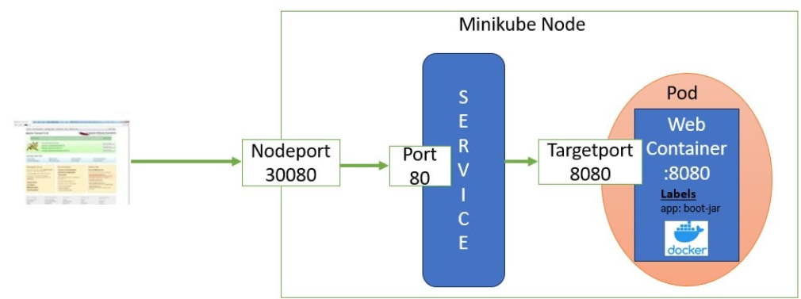
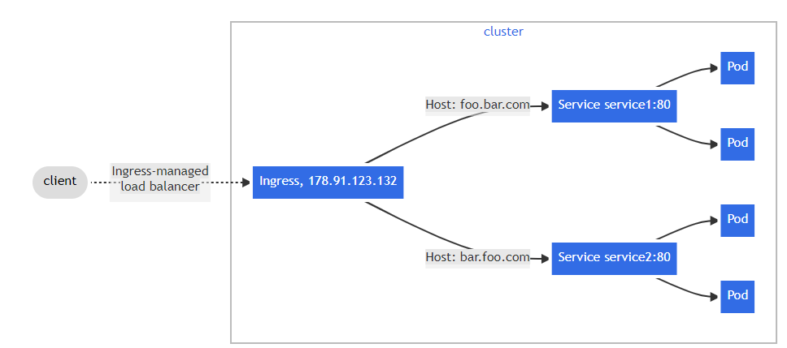

# Useful commands

## General

kube config file, where secrets and cluster set up is generally stored at ./kube/config
- container runtie libraries are located on /opt/cni/bin

```
kubectl api-resources #get api groups for specific resources. useful for rolebindings etc
alias k='kubectl'
alias all='all-namespaces'
kubectl config set-context --current --namespace default
k get  <resource> <resource_name> -o yaml > <config_dir> --as <USER>
k exec app -it -- cat /log/app.log #execute command on pod
```


## pods

```
kubectl run <pod_name> --dry-run=client --image=<image>:<tag> -o yaml > yaml_conf.yaml #generate template
kubectl run <pod_name> --image nginx
k run redis --image redis:alpine --labels tier=db
k run custom-nginx --image nginx --port 8080
k get pods -l environment=production,tier=frontend
k get pod -l env=prod,tier=frontend,bu=finance
```

## Deployments
*A ReplicaSet ensures that a specified number of pod replicas are running at any given time. 
However, a Deployment is a higher-level concept that manages ReplicaSets and provides declarative updates to Pods along with a lot of other useful features.14 Mar 2024*

```
k create deployment <deployment_name> --image httpd:2.4-alpine --replicas <replica_number> --dry-run=client -o yaml > deployment_config.yaml

k create deployment redis-deploy --image redis -n dev-ns --replicas 2
```

## Namespaces

When you create a Service, it creates a corresponding DNS entry. This entry is of the form <service-name>.<namespace-name>.svc.cluster.local, which means that if a container only uses <service-name>, it will resolve to the service which is local to a namespace. This is useful for using the same configuration across multiple namespaces such as Development, Staging and Production. If you want to reach across namespaces, you need to use the fully qualified domain name (FQDN).

Naming convention of reosurces in different namespace:
<svc_name>.<namespace>.<cluster>.<local>
- cluster is the cluster domain
- local is the suffix typically set by default

```
k create ns dev-ns

```

## Services
```
kubectl create service clusterip redis --tcp=6379:6379 --dry-run=client -o yaml

k run httpd --image httpd:alpine --port 80 --expose *creates pod AND service - Label assigned to selector in pod to connect the two*

```

## deployments
```
k create deployment webapp --image kodekloud/webapp-color --replicas 3
```

## tains and tolerations
below. use the command again to remove the taint!
```
kubectl taint nodes <node-name> key=value:<taint-effect>

```

## nodes

```
kubectl label pods app=nginx tier=fe ##add label to node
systemctl start kubelet/containerd #ssh into node
systemctl status kubelet/containers #ssh into node
journalctl -u <service_name> -f #-f is similar to tail. Service name = kubelet or containerd

```

## daemonsets
```

```

## configmaps
```
k describe cm <config_map_name>
k create cm  webapp-config-map --dry-run=client  -o yaml > cm.yaml
kubectl create configmap  webapp-config-map --from-literal=APP_COLOR=darkblue --from-literal=APP_OTHER=disregard
```

## secrets
```
kubectl create secret generic db-secret --from-literal=DB_Host=sql01 --from-literal=DB_User=root --from-literal=DB_Password=password123
```

## OS updates and maintenance
```
k drain node01 --ignore-daemonsets
kubectl uncordon node01 #after maintenance done - Deploys new pods to node when scheduled
kubectl cordon node01 #mark node as unschedulable
```

# cluster upgrades
```
kubeadm upgrade plan #check latest version 
```
# secets
```
kubectl create secret docker-registry private-reg-cred --docker-server=myprivateregistry.com:5000 --docker-username=docker_user --docker-password=dock_password --docker-email=dock_user@myprivateregistry.com #within deployment spec, add secret ref in the container in the yaml file 
```

# networking



```
ip a | grep <node_ip> #grab network interface
ip link show eth0 #get MAC address
ip route show default
netstat -nplt
kubectl logs <weave-pod-name> -n kube-system #get logs and IPAM range for pods + nodes
```

# maintenance - Upgrading kube cluster
```
kubeadm version plan #see what version you can upgrade
# Find the latest 1.29 version in the list.
# It should look like 1.29.x-*, where x is the latest patch.
vi /etc/apt/sources.list.d/kubernetes.list #edit 1.28 to 1.29 here to change visibiltiy
sudo apt update
sudo apt-cache madison kubeadm
sudo systemctl daemon-reload
sudo systemctl restart kubelet

```


